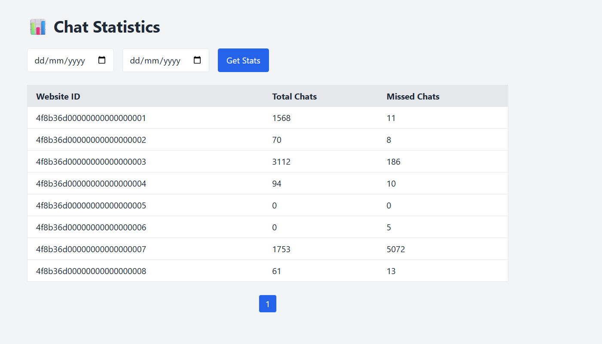

## 📊 Chat Statistics Dashboard

A TypeScript + Node.js project that fetches and displays **chat statistics per website** over time.
Supports both:

* ✅ **Script Mode**: Run with Node.js CLI and view output in terminal
* ✅ **Web Mode**: Interactive Tailwind-powered UI with filters and pagination

---

### 🚀 Features

* 📡 **Fetches live data** from a remote `webstats.json` URL
* 📅 **Date filtering** (start date, end date, or both)
* 📈 **Aggregated results** per websiteId: `chats`, `missedChats`
* 💻 **Command-line script** or 🌐 **Web dashboard**
* 🎨 **Beautiful UI** with Tailwind CSS
* 🔢 **Pagination** (10 results per page)

---

### 📂 Project Structure

```
project-root/
├── public/                  # Static HTML frontend (Tailwind UI)
│   └── index.html
├── src/                     # TypeScript source
│   ├── types.ts             # Shared interfaces
│   ├── utils.ts             # Helper for date filtering
│   ├── processor.ts         # Core aggregation logic
│   ├── index.ts             # CLI mode (script runner)
│   └── server.ts            # Web mode (Express server)
├── package.json
├── tsconfig.json
└── README.md
```

---

### 📦 Setup

#### 1. Clone & Install

```bash
git clone https://github.com/saislamb97/chat-stats-dashboard.git
cd chat-stats-dashboard
npm install
```

#### 2. Compile TypeScript (optional if using `ts-node`)

```bash
npx tsc
```

---

### 🛠️ Usage

#### 🔹 Run as a Script (CLI mode)

Prints all-time and filtered stats to terminal:

```bash
npx ts-node src/index.ts
```

---

#### 🔹 Run as Web App (UI mode)

Launches an Express server at `http://localhost:3000`:

```bash
npx ts-node src/server.ts
```

Then open: [http://localhost:3000](http://localhost:3000)

---

### 🖼️ Screenshot

>   
> *Tailwind-powered web interface with filters and pagination.*

---

### 📋 Example Output

#### 🔹 Terminal Mode Output

```json
[
  {
    "websiteId": "4f8b36d00000000000000001",
    "chats": 1568,
    "missedChats": 11
  },
  ...
]
```

#### 🔹 Browser Mode Output

* Table with `Website ID`, `Chats`, and `Missed Chats`
* Date filters with live pagination

---

### 📚 Technologies

* **Node.js + TypeScript**
* **Express.js**
* **Tailwind CSS**
* **Fetch API** + DOM for UI
* **Axios** for backend data fetching

---

### 📈 API Endpoint

`GET /api/stats?startDate=YYYY-MM-DD&endDate=YYYY-MM-DD`

Returns JSON:

```json
[
  {
    "websiteId": "string",
    "chats": number,
    "missedChats": number
  }
]
```

---

### 💡 Ideas to Improve

* [ ] Add CSV/Excel export
* [ ] Make page size configurable
* [ ] Add chart (e.g., bar chart with Chart.js)
* [ ] Deploy with Docker